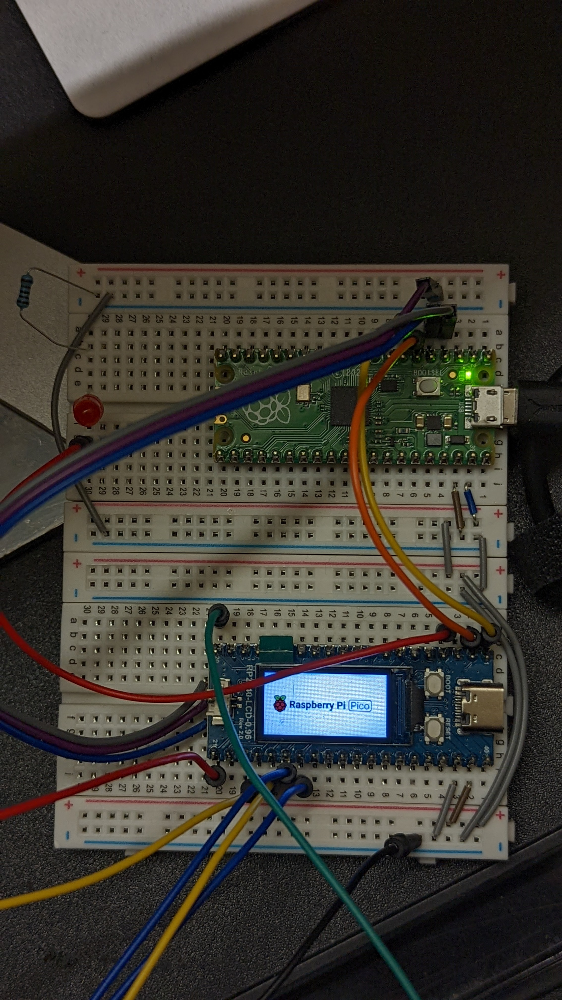

# pico-picoprobe

Debugging app on **RPi-Pico** board with `picoprobe`.


* [RPi-Pico Examples](https://github.com/raspberrypi/pico-examples)
* [Getting Started with the Raspberry Pi Pico](docs/getting-started-with-pico.pdf)
* [Getting Started with the Raspberry Pi Pico (online)](https://rptl.io/pico-get-started)
* [vscode-cmake-tools/issues/880](https://github.com/microsoft/vscode-cmake-tools/issues/880)
* [PuTTY](https://www.chiark.greenend.org.uk/~sgtatham/putty/latest.html)

## 2. Start `openocd`

```sh
# cmake presets
$ export PICO_SDK_PATH=~/workspace_pico/pico-sdk
$ export PICO_TOOLCHAIN_PATH=/c/Program\ Files\ \(x86\)/Arm\ GNU\ Toolchain\ arm-none-eabi/12.2\ mpacbti-bet1/bin
$ export PICO_SDK_PATH=~/workspace_pico/pico-sdk

$ src/openocd.exe -f tcl/interface/picoprobe.cfg -f tcl/target/rp2040.cfg -s tcl

# called by 'picoprobe Debug'
"C:/msys64/home/WRY/workspace_pico/openocd" -c "gdb_port 50000" -c "tcl_port 50001" -c "telnet_port 50002" -s "C:\\msys64\\home\\WRY\\workspace_pico\\pico-test" -f "c:/Users/WRY/.vscode/extensions/marus25.cortex-debug-1.6.5/support/openocd-helpers.tcl" -f interface/picoprobe.cfg -f target/rp2040.cfg
```

## 3. vscode's `launch.json`

```sh
LGS-NET+WRY@GEO-WCND1383YRS MINGW64 /c/msys64/home/WRY/workspace_pico/pico-examples (master) 
$ cat ide/vscode/launch-remote-openocd.json
```

```json
{
    "version": "0.2.0",
    "configurations": [
        {
            "name": "Pico Debug",
            "type":"cortex-debug",
            "cwd": "${workspaceRoot}",
            "executable": "${command:cmake.launchTargetPath}",
            "request": "launch",
            "servertype": "external",
            // This may need to be arm-none-eabi-gdb depending on your system
            "gdbPath" : "gdb-multiarch",
            // Connect to an already running OpenOCD instance
            "gdbTarget": "your-openocd:3333",
            "svdFile": "${env:PICO_SDK_PATH}/src/rp2040/hardware_regs/rp2040.svd",
            "runToMain": true,
            // Work around for stopping at main on restart
            "postRestartCommands": [
                "break main",
                "continue"
            ]
        }
    ]
}
```